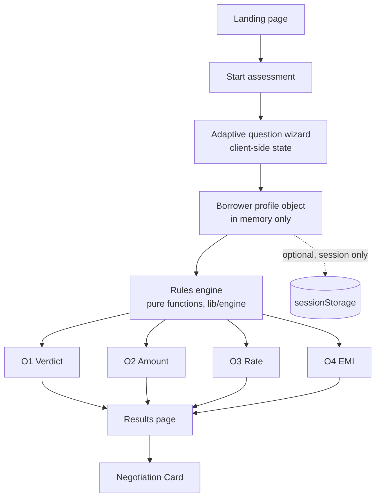
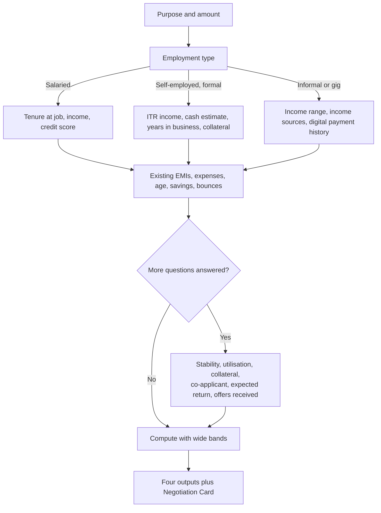
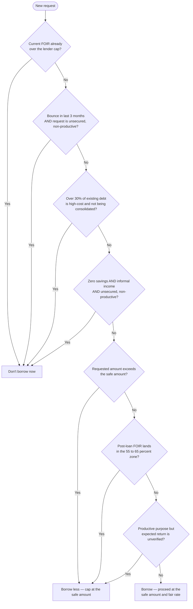

# Borrower Copilot — Implementation Plan

**Stack:** Next.js (App Router), client-side only, no backend, no stored personal data.
**Scope:** Full architecture plus fully worked domain rules — question tree, FOIR bands, rate bands, and formulas. Treat the numbers below as a strong, defensible starting point. You must still be ready to explain and defend every one of them in the follow-up session, since that is explicitly what is being tested.

---

## 1. What we are actually building

Strip away the interface and this is a small number of pure calculations wrapped in a conversation. The conversation collects a borrower profile. The calculations turn that profile into four numbers and a verdict. The interface just makes both of these easy to use on a phone.

Four outputs, always:

- **O1 — Verdict:** Borrow, Borrow less, or Don't borrow now.
- **O2 — Maximum amount:** what a lender will likely sanction, and what the borrower can safely carry. These are usually different numbers.
- **O3 — Fair rate:** a band, plus the all-in cost (APR including processing fee).
- **O4 — EMI ceiling:** a monthly number not to cross, with a tenure trade-off and one stress scenario.

Plus a **Negotiation Card** — a single screen that packages O1 to O4 into something the borrower can hold up in a branch.

The single biggest engineering decision that determines whether you pass the "Engineering" and "Explainability" scoring rows is this: **the rules must live in one place, separate from the screens, as plain data and pure functions.** Everything else in this plan supports that decision.

---

## 2. Technical architecture

### 2.1 Framework choice

Use Next.js with the App Router (current stable line is the Next.js 16.x series as of mid-2026). Do not reach for a Pages Router project — there is no reason to, and it signals you are working from stale habits rather than the current framework.

You do not need a backend. The brief is explicit: no login, no bureau pull, no personal data stored. Keep the entire rules engine running in the browser. Do not create Next.js API routes for the calculations — that would introduce a server round-trip for logic that has no business leaving the device, and it works against the "no personal data stored" requirement, since anything sent to a server is a thing you now have to promise you are not storing.

**Opinion, stated plainly:** if you find yourself reaching for a database, an API route, or an authentication library on this project, you have misread the brief. The entire point is that this runs on the borrower's own device with nothing kept afterward.

### 2.2 Folder structure

```
app/
  layout.tsx              — root layout, fonts, theme
  page.tsx                — landing page, explains the four outputs, "Start" button
  assess/
    page.tsx              — hosts the question wizard (client component)
  result/
    page.tsx              — hosts the four output cards and the Negotiation Card

lib/
  engine/
    schema.ts             — the BorrowerProfile shape (described in section 3.2)
    questions.ts           — every question, its type, and its visibility condition
    confidence.ts          — how the confidence band widens or narrows
    rules/
      segments.ts          — salaried / self-employed / informal definitions
      foir.ts               — FOIR caps table and adjustments
      amount.ts             — O2: lender sanction vs safe amount
      rate.ts               — O3: rate bands, positioning, APR
      emi.ts                — O4: EMI ceiling, tenure table, stress test
      decision.ts           — O1: the hard-block and soft-caution checks
    card.ts                 — assembles the Negotiation Card from the four outputs

components/
  wizard/
    QuestionStep.tsx
    ProgressConfidenceBar.tsx
  results/
    VerdictBanner.tsx
    AmountComparisonCard.tsx
    RateBandCard.tsx
    EmiCeilingCard.tsx
    StressToggle.tsx
    NegotiationCard.tsx
  dev/
    PersonaQuickLoad.tsx    — pre-fills Priya, Ravi, Anita for fast testing; hide behind a flag, never a production feature

data/
  rules-config.ts           — the single source of numeric constants: every band, cap, and multiplier used by lib/engine. This file and RULES.md should say the same thing, always.

docs/
  RULES.md
  walkthroughs/
    priya.md
    ravi.md
    anita.md
  README.md
```

The key discipline: **`data/rules-config.ts` is the only place a number is typed in.** Every function in `lib/engine` reads from it. RULES.md is a human-readable rendering of the same file. If you ever change a threshold in two places, you have already broken the "rules separated from UI" requirement.

### 2.3 State management

Use React Context plus `useReducer` for the borrower's in-progress answers. One reducer, one action type (`SET_ANSWER`), one object shape. This is a wizard with conditional branching, not a large application — reaching for Redux, Zustand, or a form library like React Hook Form adds dependencies you do not need for nine to twenty fields. Keep it dependency-light; that is itself a signal of engineering judgement.

Derive everything else. Do not store O1 to O4 in state. Compute them on every render from the current answers, using the pure functions in `lib/engine`. This guarantees the outputs can never drift out of sync with the answers, and it makes the engine trivially testable on its own, with no UI involved.

Persistence: none by default, matching the brief. If you want resilience against an accidental page refresh, `sessionStorage` (cleared when the tab closes) is an acceptable middle ground — never `localStorage`, since that persists indefinitely and edges toward "storing personal data" in spirit even if not in name. Treat this as a stretch item, not a requirement.

### 2.4 Styling

Tailwind CSS is the pragmatic default here — it is fast to build phone-first layouts in, and "works on a phone" is an explicit scoring line. Do not spend build hours on animation or visual polish beyond a clean, readable, high-contrast layout. The brief tells you what is not scored: pixel perfection is on that list.

### 2.5 Architecture and data flow



---

## 3. Domain engine design

### 3.1 Design principle

Separate three things that are easy to tangle together:

1. **What we ask** — the question tree, with visibility rules (`questions.ts`).
2. **What we know** — the borrower profile built from answers, plus derived fields like assessed income (`schema.ts`).
3. **What we conclude** — the four outputs, computed by pure functions that take a profile and the rules config and return a result (`rules/*.ts`).

None of these should import React. If a function in `lib/engine` cannot be tested by calling it with a plain object and checking the return value, it is in the wrong place.

### 3.2 The borrower profile (data shape, described)

Core fields collected directly: purpose, amount wanted, employment segment, net monthly income (or income range), years in job or business, existing EMI total, essential monthly expenses, age, credit score or "unknown."

Derived fields, computed once inputs exist: assessed income (after any haircut — see 3.3), current FOIR (before the new loan), risk tier (prime / near-prime / sub-prime / unscored), and a confidence level (wide / medium / narrow).

### 3.3 Income assessment by segment

Real income is not always the number a borrower states, especially outside formal salaried work. This is the single most important judgement call in the whole engine, so state it plainly and put it in RULES.md in exactly this form:

| Segment | Assessed income formula | Why |
|---|---|---|
| Salaried | Net monthly income as stated | Payslip-verifiable in real life; treat as reliable |
| Self-employed, formal (has ITR) | Average of (ITR monthly income, midpoint of self-declared cash income), then apply a haircut based on variable-income share: 0% if variable share under 20%, 10% if 20 to 40%, 20% if over 40% | ITR alone under-states cash businesses; self-declared cash alone is unverifiable; blending and then discounting for volatility is a defensible middle ground |
| Informal / gig, no ITR | Midpoint of self-declared income range, then a flat 25% haircut | No document exists to cross-check against, so the discount is larger and applies regardless of stated stability |

### 3.4 Confidence mechanics

Confidence is not a vague label — tie it to something countable: the number of additional (non-must) questions answered, as a share of the additional questions that apply to that borrower's segment.

- **0 to 30% of applicable additional questions answered → Wide.** Show O2 to O4 as wide ranges (roughly ±20 to 25% around the calculated midpoint), and say explicitly: "Based on the minimum information. Answer more questions to narrow this."
- **30 to 70% → Medium.** Ranges narrow to roughly ±10%.
- **Over 70% → Narrow.** Show close to point estimates, still as a small band (roughly ±5%), never a single false-precision number.

Rule to enforce everywhere: **a range only narrows when an answer gives a reason to narrow it.** Never narrow a range purely because time has passed or because the borrower reached a later screen with no new information.

Unknown answers (credit score, for instance) do not get treated as the worst possible value. They get treated as their own category with a defined, usually conservative, fallback — and the UI should say "unknown, so we assumed X" rather than silently downgrading.

---

## 4. The question tree

### 4.1 Must questions (the minimum set — 9 questions)

If a borrower answers only these, all four outputs must still compute, with wide ranges.

| # | Question | Feeds |
|---|---|---|
| 1 | What is the loan for? (wedding/discretionary, medical, education, home, personal vehicle, commercial vehicle, business stock/equipment, debt consolidation, other) | O1, O3 product routing |
| 2 | How much do you want to borrow? | O1 (compared against O2), O4 baseline |
| 3 | What is your employment type? (salaried / self-employed with ITR / self-employed or gig, informal) | Segment for everything downstream |
| 4 | What is your net monthly income? (single figure for salaried; a range for self-employed/informal) | O2, O4 |
| 5 | How long have you been in this job or business? | O3 stability adjustment, sanction multiple |
| 6 | What are your total existing monthly EMI payments? | O2, O4 |
| 7 | What are your essential monthly expenses (rent, food, school fees, utilities)? | O4 residual-income check |
| 8 | What is your age? | Maximum tenure = min(product's usual max tenure, 60 or 65 minus age) |
| 9 | Do you know your credit score? If yes, what is it? | O3 tier, O2 multiple; "no" opens the proxy-signal branch below |

### 4.2 Additional questions (each one must move a number — 11 questions)

| Question | Applies to | Tightens | Why |
|---|---|---|---|
| What share of your income is variable (bonus, commission, incentive)? | Salaried, self-employed | O2 (income haircut), O3 (stability) | High variability is a real repayment risk even at a good average income |
| Detail of existing loans: secured or unsecured, remaining tenure, rate if known | All | O2 (accurate FOIR subtraction), O4 (realistic stress test) | A flat "total EMI" figure hides whether existing debt is about to end soon or is high-cost |
| Average credit card utilisation | All with a card | O3 (proxy for risk if score unknown) | High utilisation is one of the strongest early-warning signals lenders use |
| Any bounced EMI, cheque, or auto-debit in the last 12 months? How recent? | All | O1 (hard-block trigger), O3 (risk pricing) | A recent bounce is the single strongest predictor of near-term default |
| How many months of expenses do you hold in savings? | All | O1, O4 stress severity, safe amount buffer | Directly determines how much shock the borrower can absorb |
| Do you have an asset you could offer as collateral (property, gold, fixed deposit)? Approximate value? | All | O2 ceiling (unlocks secured routing), O3 (moves to a lower-rate band) | Collateral changes which product applies, not just the price |
| Is there a co-applicant with income? How much? | All | O2 (combined eligibility), O4 | Household eligibility is materially different from individual eligibility |
| Any large expected expense in the next 6 to 12 months? | All | O4 (subtracted from the residual buffer) | A safe EMI today can become unsafe the month school fees are due |
| If this loan is for business or income use, what extra income or saving do you expect it to create? | Business/productive purpose only | O1 (can lift a "borrow less" caution if credible) | A loan that pays for itself is a different risk than one that does not |
| Have you already received a quote from a lender? Rate, fee, tenure? | All | Feeds the Negotiation Card directly | This is the number the borrower is about to compare against |
| Roughly how many income sources do you have, and do you use digital payments regularly for your business? | Informal segment only | O2 (income haircut), O3 (tier) | The closest available substitute for a credit history when no formal one exists |

### 4.3 Adaptive flow



A salaried applicant never sees the ITR or cash-income questions. An informal applicant never sees a "credit card utilisation" question if they said they have no card. This is what "adaptive" means in practice — branch on the answer that was just given, not on a fixed page order.

---

## 5. The four outputs, fully worked

Every number below is anchored to the RBI repo rate of 5.25%, which has held steady through 2026 as of this writing. Re-check this figure before you submit — it is a live variable, and if it has moved, your bands should move with it. Everything else here is stated as the author's judgement, modelled on common Indian lending practice, not copied from one lender's published policy. Say the same thing in your RULES.md.

### 5.1 FOIR caps (drives O2 and O4)

FOIR — Fixed Obligation to Income Ratio — is the share of monthly income that can go toward all loan payments combined. Two caps per segment: what a lender will typically allow, and a stricter one the borrower should hold themselves to.

| Segment | Income tier | Lender FOIR cap | Safe FOIR cap |
|---|---|---|---|
| Salaried | Under ₹30,000 | 40% | 30% |
| Salaried | ₹30,000 to ₹75,000 | 50% | 40% |
| Salaried | Over ₹75,000 | 55% | 45% |
| Self-employed, formal | Any | 45% | 35% |
| Informal / gig | Any | 35% | 25% |

Adjustments applied on top:

- Credit score under 650, or unscored with any red-flag proxy signal: **minus 5 points** from both caps.
- A bounce in the last 6 months: **minus 10 points** from the safe cap only (push toward caution or a block, not toward a lower lender-side number — the lender's own underwriting will already price this in through the rate).
- Collateral pledged, moving to a secured product: **plus 5 points** to the lender cap only. The safe cap does not move. This is a deliberate rule: collateral reduces the lender's loss if things go wrong, but it does not reduce the real strain on the borrower's monthly cash flow, and the app should never let collateral be used to justify an unaffordable EMI.

### 5.2 O2 — Maximum amount

Two figures, computed differently, and the app should always say which one to use ("use the safe number unless a lender specifically requires the higher one, and understand why they differ").

**Lender-likely sanction** = the smallest of:
- FOIR-based capacity: (assessed income × lender FOIR cap) minus existing EMIs, converted to a loan amount at the applicable rate and tenure using the EMI formula in reverse.
- For secured products only: the loan-to-value ceiling — 50% of asset value if the borrower has no prior formal loan history, 60% if they do; 75% for gold, which is the regulatory ceiling and should never be exceeded even if a lender offers to.
- For unsecured products only: an income-multiple ceiling — up to 24 times net monthly income for a salaried prime borrower (credit score 750+), 15 times for salaried near-prime, 8 times for salaried sub-prime or unscored, 10 times for formal self-employed. Do not apply an income-multiple ceiling to secured products — once collateral is pledged, LTV and FOIR are the correct governors, and stacking an unsecured-style multiple on top of that under-states what a real lender would sanction.

**Safe amount** = the more conservative of:
- The same FOIR-based calculation, using the safe FOIR cap instead of the lender cap.
- A residual-income check: assessed income minus essential expenses minus existing EMIs minus the new EMI must leave at least 15% of income unspent. If this produces a lower loan amount than the FOIR calculation, use it — always take the more conservative of the two.

### 5.3 O3 — Fair interest rate

Base bands, before individual risk positioning, anchored to the 5.25% repo rate as of September 2026:

| Product | Spread over repo | Approximate band |
|---|---|---|
| Home loan | +2.00 to +3.25 points | 7.25% to 8.50% |
| Loan against property | +3.75 to +5.75 points | 9.00% to 11.00% |
| Gold loan | +4.00 to +8.00 points | 9.25% to 13.25% |
| Business loan, secured | +5.00 to +9.00 points | 10.25% to 14.25% |
| Two-wheeler loan | +5.50 to +9.50 points | 10.75% to 14.75% |
| Personal loan, unsecured, prime | +6.00 to +9.00 points | 11.25% to 14.25% |
| Personal loan, unsecured, near or sub-prime | +9.25 to +16.00 points | 14.50% to 21.25% |
| High-cost informal or app loans | 24%+ | Flag as "avoid," never recommend |

Positioning within the band: a full risk-tier improvement (say, sub-prime to near-prime) moves the expected rate about one-third of the way down the band. Each year of job or business stability beyond three years shaves a small fixed amount, capped at half a point total. Keep this simple and state it as judgement — the point is that it is a rule the borrower can follow along with, not that it matches any one lender's actual pricing model exactly.

**APR (all-in cost):** RBI's Key Fact Statement rules require lenders to disclose the effective annual cost, not just the nominal rate. Approximate it as:

APR ≈ nominal rate + (processing fee amount ÷ loan amount) × (12 ÷ tenure in months) × 100

Use a processing fee assumption of 1 to 2% of the loan amount plus 18% GST on that fee if the borrower has not yet received an actual quote. This approximation understates the true effective rate slightly on longer tenures; if time allows, replace it with a proper internal-rate-of-return calculation over the full cash flow (disbursal minus fees, followed by the EMI stream). Ship the approximation for v1 and say so in RULES.md — an honest approximation beats a precise number you cannot explain.

### 5.4 O4 — EMI ceiling, tenure trade-off, and stress test

EMI ceiling = the safe amount from 5.2, expressed as a monthly figure at whatever tenure is being shown.

Show at least three tenure points appropriate to the product (for example, 2, 3, and 5 years for a personal loan; 10, 15, and 20 years for a home loan), each with its EMI and total interest paid, so the trade-off between a higher monthly payment and a lower total cost is visible rather than implied.

**Stress test**, applied as a single combined worst case:

- Income shock: minus 25% (models a job loss or a slow season).
- Rate shock: plus 150 basis points (models roughly one to two policy rate moves' worth of transmission).

Recompute the FOIR under both shocks together. If it now exceeds the segment's lender cap, show a direct warning: "In this scenario your EMI would take up X% of your income, above what is considered safe. Consider a longer tenure or a smaller loan."

---

## 6. O1 — the verdict, as a decision tree



One rule worth stating explicitly, because it will come up with a two-wheeler or vehicle loan: **hypothecating a vehicle does not count as strong collateral for these checks.** Only real estate, gold, or a fixed deposit count, because a repossessed two-wheeler recovers only a fraction of what is owed. A vehicle loan is still evaluated as if it were effectively unsecured for the purposes of the hard-block checks, even though the vehicle itself is technically pledged.

---

## 7. Negotiation Card

One screen, phone-first, meant to be read by someone standing at a bank counter. Fields, in order:

1. Loan type and amount requested.
2. Fair rate band for this profile, and the all-in APR range.
3. One sentence why: name the top two factors that set this band (for example, "based on your credit score tier and five years of stable income").
4. Safe EMI ceiling at the recommended tenure, with a note on the tenure trade-off.
5. Safe amount and lender-likely amount, side by side, each with its one-line why, and a clear statement of which one to use.
6. A blank field: "Lender's actual quote," so the borrower can write in what they were offered and compare on the spot.
7. One line on what to say if the quote is higher: name the two or three most common legitimate reasons (risk-based pricing, bundled insurance that can usually be declined) rather than assuming bad faith.
8. A confidence note: how many of the applicable questions were answered, and an invitation to answer more to narrow the numbers further.

---

## 8. RULES.md — structure and starter rows

The brief wants every rule, threshold, and assumption in one table: **what, value, why, source or "my judgement."** Everything in section 5 and 6 above can be transcribed directly into this format. A starter slice:

| What | Value | Why | Source |
|---|---|---|---|
| Repo rate anchor | 5.25% | Base for all rate bands | RBI MPC, held since Feb 2026 — verify before submission |
| Salaried FOIR, lender cap, income over ₹75,000 | 55% | Common upper bound for well-paid salaried borrowers at Indian banks and NBFCs | My judgement |
| Salaried FOIR, safe cap, income over ₹75,000 | 45% | Ten-point buffer below the lender cap so the borrower is not living at the edge | My judgement |
| Informal segment income haircut | 25% flat | No document exists to verify a self-declared cash income | My judgement |
| Collateral effect on FOIR | +5 to lender cap only | Reduces lender loss, does not reduce borrower's real monthly strain | My judgement |
| Vehicle hypothecation | Not treated as strong collateral | Low resale recovery on a repossessed two-wheeler | My judgement |
| Stress test, income shock | −25% | Models a job loss or a slow season | My judgement |
| Stress test, rate shock | +150 bps | Roughly one to two policy rate moves | My judgement |
| Processing fee assumption, if no quote given | 1.5% + 18% GST | Typical range at Indian banks and NBFCs | My judgement |
| Gold loan LTV ceiling | 75% | Regulatory ceiling | RBI |

Expand this table to cover every number the engine actually uses — the version above is a skeleton, not the finished document.

---

## 9. Worked examples against the three personas

These are illustrative, done by hand to confirm the rules produce sensible, defensible answers. Run the real app and use its exact output for your actual deliverable — do not just copy these numbers in.

### Priya — salaried, Bengaluru

Segment: salaried, income tier over ₹75,000. FOIR caps: lender 55%, safe 45% (excellent score, no adjustment). Assessed income: ₹1,10,000. Existing EMI ₹14,000.

- Available EMI: lender ≈ ₹46,500/month, safe ≈ ₹35,500/month.
- Converting at a fair rate for her profile over a mid-length tenure, her safe capacity comfortably covers her ₹8,00,000 ask.
- **O1: Borrow.** The request sits inside the safe amount, so there is no reason to shrink it.
- **O2:** Lender-likely sanction well above ₹8,00,000; safe amount also above it — use the ₹8,00,000 she asked for, or note she has room to go higher if she genuinely needs to.
- **O3:** Personal loan, unsecured, prime tier, strong stability — expect the bottom of the prime band, roughly 11.5% to 13%, APR slightly above that once a typical fee is added.
- **O4:** Show EMI at three tenures; recommend the shortest one her comfortable monthly outflow supports, since a shorter tenure meaningfully cuts total interest for someone this well within her limits.

### Ravi — self-employed, Mysuru

Segment: self-employed, formal (ITR exists). Assessed income (after blending ITR and cash estimate, then a 20% volatility haircut for a highly cash-driven business): roughly ₹38,000/month individually. No credit score — minus 5 points to both FOIR caps. Owns unencumbered premises worth ₹45,00,000 — this unlocks a secured route and adds 5 points back to the lender cap only.

- **O1: Borrow less.** His ₹15,00,000 ask is well above his individually-assessed safe amount (roughly ₹6.5 to 7 lakh). This is not a rejection — it is a sizing correction.
- **O2:** Individually, lender-likely sanction lands around ₹10 lakh on a secured, long-tenure product; safe amount around ₹6.5 to 7 lakh. If his wife is added as a formal co-applicant, household-income lender sanction moves close to his full ₹15 lakh ask — worth surfacing as an explicit option, not assumed by default.
- **O3:** Routed to a secured business loan or loan-against-property product on the strength of his collateral and fourteen years in business, even with no bureau score — expect the middle of the secured band, roughly 10.5% to 12%.
- **O4:** Recommend a tenure suited to the asset life (a delivery vehicle is not a fifteen-year asset), and show him clearly that his own income alone does not support the full ask — the co-applicant path is the honest way to close the gap, not a bigger loan against the same individual income.

### Anita — informal, Hubballi

Segment: informal. Assessed income after the flat 25% haircut: roughly ₹21,000/month. Existing debt: three app loans at 30%+ APR, all of it high-cost, none being consolidated by the new request. A bounce in the last month.

- **O1: Don't borrow now.** The high-cost-debt trigger fires on its own — all of her existing obligations are above the 24% high-cost threshold, and the new request does nothing to address that. The recent bounce reinforces the same conclusion. The scooter idea itself is reasonable; the timing, given what she already owes, is not.
- **O2, O3, O4:** Do not compute a "go ahead" number here. Show instead what would need to change: clear or restructure the existing high-cost debt, rebuild three to six months of on-time payments, then re-run the assessment. This is the honest use of "unknown is never zero" and "don't is a legitimate answer" together.
- Note for your write-up: this is the case that tests whether your "Don't" path is actually reachable, not just theoretically present in the code.

---

## 10. Build plan across four days (12 to 16 hours)

**Day 1 — Foundations (3 to 4 hours).** Lock the RULES.md skeleton from section 8, adjusting anything you disagree with. Set up the Next.js project, folder structure, and Tailwind. Build the must-question wizard with static, non-adaptive questions and no engine behind it yet.

**Day 2 — The engine (3 to 4 hours).** Build `lib/engine` as standalone functions with no UI dependency: FOIR, amount, rate, EMI, decision, confidence. Wire the wizard's answers into the engine and get all four outputs rendering for the must-question set alone, in wide-range mode, for at least one persona end to end.

**Day 3 — Adaptive depth (3 to 4 hours).** Add the eleven additional questions with their visibility rules. Add confidence narrowing. Build the Negotiation Card. Run all three personas through the finished flow and capture the questions asked, outputs produced, and card for each — this is deliverable 3.

**Day 4 — Polish and defend (3 to 4 hours).** Write RULES.md properly, covering every threshold the engine actually uses. Write the README with exact run instructions. Record the five-minute walkthrough. Leave real time for bug fixing and a pass on a real phone screen, not just a resized browser window.

---

## 11. Validation checklist before you submit

- Each persona reaches a verdict you can defend out loud in one sentence.
- Anita's run actually produces "Don't borrow now" — the block path is proven reachable, not just written.
- Confidence visibly widens when only must-questions are answered, and narrows as additional ones are answered.
- An unknown credit score is visibly handled as "unknown," never silently treated as a poor score.
- At least one persona shows the lender-likely amount and the safe amount as genuinely different numbers, with the app stating which one to use.
- The APR shown differs from the nominal rate once a processing fee is included.
- Every figure on the results page and the Negotiation Card can be traced to a one-sentence reason.
- The full flow works on a 375-pixel-wide screen.
- `data/rules-config.ts` and RULES.md agree on every number — check this last, since it is the easiest thing to let drift.

---

## 12. What to cut, what to add if time remains

**Cut for this version:** payslip or ITR upload and OCR, multiple languages, a login of any kind, more loan products than the three personas require, a PDF export of the card (a browser print or screenshot is enough), and any animation beyond simple transitions.

**Add only if the four days allow it:** `sessionStorage` resilience against an accidental refresh, print-optimised styling for the Negotiation Card, a proper internal-rate-of-return APR calculation in place of the approximation, a small chart showing the EMI-versus-tenure trade-off, and a visible "why this number" trace log attached to each output.

---

## 13. Assumptions to state up front in your submission

Say these plainly rather than letting a reviewer discover them:

- The repo rate and every rate band are anchored to the RBI's published rate as of September 2026 and must be re-checked if that has changed by the time you submit.
- Every FOIR cap, income-multiple ceiling, and haircut is your own judgement, built to be internally consistent and to match the general shape of Indian lending practice — not copied from one specific lender's underwriting policy, because no such single public source exists for all of this at once.
- The APR formula used in v1 is an approximation, not a full cash-flow-based effective rate calculation, and you know the difference.

This document gets you to a defensible first version. The follow-up session will ask you to change one of these assumptions on the spot — which is exactly why keeping every number in one config file, separate from the screens, is not a nice-to-have. It is the difference between a five-minute live edit and a scramble through your own component tree.
